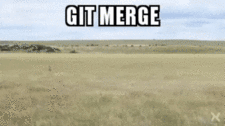

## WeTheSWEople presents:
### SWEThePeople
Raul Camacho, William Han, Palak Hirpara, Minwoo Jo, Benjamin Singer, Michael Tirtowidjojo
---
### Raul Camacho
##### *Camacho Style Sheets*

**Responsibilities:**
* Frontend design and CSS
* Front-end unit and acceptance tests
* Making things look pretty
---
### William Han
##### *Bill*

**Responsibilities:**
* Districts front-end
* Backend unit tests
* Deployment
* Blockchain integration in the cloud
---
### Palak Hirpara
##### *The Decider*

**Responsibilities:**
* Representatives frontend and backend
* Districts backend
* Backend unit tests
* Breaking stuff
---
### Minwoo Jo
##### *MJ*

**Responsibilities:**
* District frontend and backend
* API design
* Translating Benny into English
---
### Benjamin Singer
##### *Benny*

**Responsibilities:**
* Representatives frontend
* Districts backend
* Documentation
* Having too many issues
---
### Michael Tirtowidjojo
##### *Mojo Jojo*

**Responsibilities:**
* Parties frontend and backend
* Chief of chief naming
---
## SWEThePeople
@ul
* Present the interplay between Parties, Districts, Representatives
* Learn more about parties and choices representatives make through the demographics of their districts
@ulend
---
## Tests
[TravisCI](https://travis-ci.org/WeTheSWEople/SWEThePeople)
---
## Data Sources
* ProPublica
  * Representative information
* GovTrack
  * Bills
* Census
  * District information
* TheUnitedStates.io
  * Representative photos
---
## Demonstration
[SWEThePeople.me](http://swethepeople.me)
* Navigation
  * Navigation bar
  * Inter-model Navigation
    * Representatives
    * Parties
    * Districts
  * Filter, Sort, Pagination
  * Search ("Google-like")
---
### Self-Critique
### What did we do well?
@ul
* Planned ahead
* Clearly delineated tasks
* Communicated effectively via Slack and Github
@ulend
---
### Self Critique
### What did we learn?
@ul
* How to work as a team on a large project
* Importance of tracking bugs, handling them
* Benefits of linted code
* How to utilize new tools
@ulend
---
### Self Critique
#### What can we do better?

@ul
* Create a consistent code-quality standard before starting the project
* Creating issues whenever we find a bug
* Improve story planning and timing
@ulend
---
### Self Critique
#### What puzzles us?

@ul
* How to intuitively present large amounts of data
* How to properly integrate "old stories" into sprints with new tasks
* How to most-equitably split up tasks on a large team
* Gitbook
@ulend

---
[HikingAdventures.me](http://HikingAdventures.me)
---
## Other Critique
### What did they do well?
@ul
* Integrated three challenging models
* Found strong attributes to use for each model
* Went beyond the specs when they could
@ulend
---
## Other Critique
### What did we learn from their website?
@ul
* Interesting approach to API design
* More in-depth filtering options
@ulend
---
## Other Critique
### What can they do better?
@ul
* Searching based on photo attributes
* Better details page design
* Better handling of user errors
@ulend
---
## Other Critique
### What puzzles us about their website?
@ul
* Why does the team place a YouTube search result video front and center on their grid pages?
* Why the current design?
@ulend
---
## [Visualization](http://swethepeople.me/visualization.html)
---
## Tests
[TravisCI](https://travis-ci.org/WeTheSWEople/SWEThePeople)
